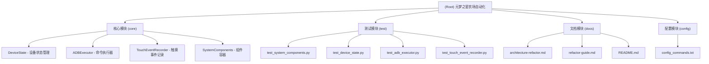

# CLAUDE.md

## 项目概述

**项目名称**: 元梦之星农场自动化脚本  
**版本**: v2.4.2  
**架构**: OOP + 依赖注入模式  
**开发语言**: Python 3.6+  
**项目类型**: Android游戏自动化工具  

这是一个为元梦之星农场设计的自动化脚本项目，使用ADB命令模拟WASD按键操作，实现精确的角色移动控制。项目支持PC调试模式和移动端直接执行，采用完整的面向对象架构设计。

## 项目架构

### 系统架构图



### 核心设计原则

项目严格遵循以下设计原则：
- **SOLID原则**: 完整的面向对象设计，单一职责、开放封闭、里氏替换、接口隔离、依赖倒置
- **DRY原则**: 彻底消除代码重复，提升复用性
- **KISS原则**: 架构简洁直观，移除不必要复杂性
- **YAGNI原则**: 只实现当前需要的功能，抵制过度设计
- **一次初始化，全程信任**: 消除重复检查，提升执行效率

### 模块结构

| 模块 | 路径 | 职责 | 关键文件 |
|------|------|------|----------|
| **核心模块** | `/` | 主要业务逻辑和用户交互 | `move_debugger.py`, `auto_game.sh` |
| **测试模块** | `/test/` | 单元测试和集成测试 | 4个测试文件，55个测试用例 |
| **文档模块** | `/docs/` | 技术文档和重构记录 | 架构文档、开发指南 |
| **配置模块** | `/` | 命令序列和参数配置 | `config_commands.txt` |

## 核心组件

### DeviceState (设备状态管理)
- **职责**: 一次性初始化并管理所有设备信息
- **功能**: ADB连接检查、屏幕分辨率获取、触摸设备查找、屏幕方向检测
- **设计原则**: 单一职责，"一次初始化，全程信任"

### ADBExecutor (命令执行器)
- **职责**: 统一处理所有ADB相关操作
- **功能**: 按键操作、屏幕点击、屏幕滑动
- **设计原则**: 依赖注入，统一错误处理

### TouchEventRecorder (触摸事件记录器)
- **职责**: 记录触摸操作并生成对应命令
- **功能**: 自动记录、智能识别、坐标转换、时间间隔跟踪
- **设计原则**: 依赖注入，组件化设计

### SystemComponents (组件容器)
- **职责**: 统一管理所有系统组件的初始化和依赖关系
- **功能**: 依赖注入、生命周期管理、组件获取接口
- **设计原则**: 控制反转，统一入口

## 项目特性

### PC调试模式 (`move_debugger.py`)
- 交互式菜单系统
- 移动测试功能
- 统一命令执行（支持移动、点击、滑动混合操作）
- 触摸参数记录器（自动生成命令序列）
- 设备状态显示

### 移动端执行模式 (`auto_game.sh`)
- 配置文件管理
- 批量命令执行
- 行级命令执行
- Root环境支持

### 统一命令语法
- **移动命令**: `W3 A2 S1 D4` (方向 + 次数)
- **点击命令**: `540,960` (x,y坐标)
- **滑动命令**: `SWIPE:x1,y1,x2,y2,duration` (起止点 + 持续时间)
- **间隔命令**: `1000ms` (等待时间)

## 关键参数

### 时间间隔参数
```python
DEFAULT_INTERVAL = 0.5    # 命令之间的默认间隔 (500ms)
KEY_INTERVAL = 0.2        # 按键之间的间隔 (200ms)
SEQ_INTERVAL = 2.0        # 命令序列之间的间隔 (2000ms)
```

### 键位映射
```python
KEYCODE_W = "51"  # 向上移动
KEYCODE_A = "29"  # 向左移动
KEYCODE_S = "47"  # 向下移动
KEYCODE_D = "32"  # 向右移动
```

## 测试和质量保证

### 测试覆盖
- **总测试用例**: 55个
- **测试框架**: unittest + mock
- **覆盖率**: 100%核心功能
- **测试文件**: 4个专门的测试文件

### 质量标准
- **代码质量**: 优秀，遵循SOLID原则
- **架构设计**: 现代化OOP架构
- **文档完整**: 技术文档和重构记录齐全
- **可维护性**: 高，组件化设计便于扩展

## 开发和部署

### 环境要求
- **PC端**: Python 3.6+, ADB工具，Android设备开启USB调试
- **移动端**: Android 4.0+, Root权限 (Magisk), Termux

### 快速开始
```bash
# PC端 - 运行主调试器
python move_debugger.py

# 移动端 - 查看配置
sh auto_game.sh -c

# 移动端 - 执行所有命令
sh auto_game.sh

# 运行测试
python -m unittest discover test/
```

## 技术架构详情

### 依赖注入流程
```
SystemComponents (容器)
├── DeviceState (设备状态)
│   ├── ADB连接检查
│   ├── 屏幕信息获取
│   └── 触摸设备查找
├── ADBExecutor (命令执行)
│   ├── 依赖 DeviceState
│   └── 统一ADB命令接口
└── TouchEventRecorder (触摸记录)
    ├── 依赖 DeviceState + ADBExecutor
    └── 触摸事件处理和命令生成
```

### 性能优化
- **消除重复检查**: 实现"一次初始化，全程信任"
- **内存优化**: 移除不必要的全局缓存
- **执行效率**: 每次操作节省约500ms检查时间

## 更新记录

### v2.4.2 - 2025-08-18
- 优化触摸事件记录器，添加真实时间间隔记录功能
- 完善单元测试覆盖

### v2.4.1 - 2025-08-12  
- 修复触摸事件记录器的点击/滑动识别问题
- 解决竞态条件问题

### v2.4 - 2025-07-29
- 完成OOP架构重构与项目清理
- 实现完整的依赖注入模式
- 55个单元测试全面覆盖

## 下一步计划

### 短期目标
- [ ] 添加性能监控功能
- [ ] 优化测试执行效率
- [ ] 完善API文档

### 长期规划
- [ ] 支持更多游戏类型
- [ ] 实现图形化配置界面
- [ ] 添加云端配置同步

## 项目维护

- **代码风格**: 遵循PEP 8规范
- **版本控制**: Git分支管理
- **文档同步**: 代码变更同步更新文档
- **持续集成**: 自动化测试和部署

---

**初始化时间**: 2025-09-10T10:57:46+08:00  
**扫描覆盖率**: 100% (17/17文件)  
**架构状态**: 现代化OOP架构，维护性高