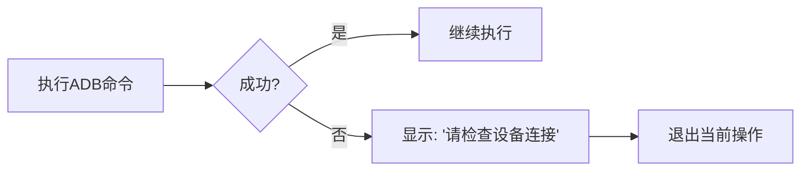

# 设备自动化脚本架构重构指南

## 一、背景与现状

### 1.1 现有问题
- **重复调用**：每个操作都重复检查ADB连接、获取设备信息
- **冗余日志**：相同信息重复输出，日志杂乱
- **职责分散**：设备状态管理分散在多个函数中
- **复杂缓存**：不必要的多层缓存机制增加了复杂度

### 1.2 重构目标
- **简化设计**：程序启动时一次性获取所有设备信息
- **消除重复**：避免所有重复调用和检查
- **明确职责**：清晰划分各组件职责
- **用户体验**：错误提示简洁明了（"连接失败请检查"）

## 二、新架构设计

### 2.1 核心设计原则
> **"一次初始化，全程信任"**  
> 程序启动时获取所有设备信息，后续不再检查，失败即提示用户

### 2.2 架构图解
```
[程序启动]
       ↓
[DeviceState初始化]  → 获取并存储所有设备信息
       ↓
[ADBExecutor]        → 直接使用DeviceState的数据
       ↓              执行命令时不再检查连接
[TouchEventRecorder] → 与ADBExecutor协同工作
```

### 2.3 核心组件

#### 2.3.1 `DeviceState`类（核心）
**职责**：一次性获取并存储所有设备信息
```python
class DeviceState:
    def __init__(self):
        self.is_valid = False
        self.device_info = None      # 设备信息
        self.screen_width = None     # 屏幕宽度
        self.screen_height = None    # 屏幕高度
        self.touch_device = None     # 触摸设备信息
        # 格式: {'device': '/dev/input/eventX', 'max_x': 4095, 'max_y': 4095}
        
    def initialize_all(self) -> bool:
        """一次性初始化所有设备信息"""
        try:
            # 1. 检查ADB连接
            if not self._check_adb_connection():
                return False
                
            # 2. 获取屏幕分辨率
            self.screen_width, self.screen_height = self._get_screen_resolution()
            
            # 3. 查找触摸设备
            self.touch_device = self._find_touch_device()
            
            self.is_valid = True
            return True
            
        except Exception as e:
            logger.error(f"设备初始化失败: {e}")
            return False
```

#### 2.3.2 `ADBExecutor`类（执行层）
**职责**：执行所有ADB命令，依赖DeviceState
```python
class ADBExecutor:
    def __init__(self, device_state: DeviceState):
        self.device_state = device_state
        
    def press_key(self, keycode: str, count: int, delay: float = 0.2):
        """执行按键命令 - 不检查连接状态"""
        for _ in range(count):
            self._run_adb_command(f"input keyevent --longpress {keycode}")
            time.sleep(delay)
    
    def tap_screen(self, x: int, y: int):
        """执行屏幕点击"""
        self._run_adb_command(f"input tap {x} {y}")
    
    def _run_adb_command(self, command: str) -> bool:
        """执行ADB命令，失败返回False"""
        result = subprocess.run(
            f"adb shell {command}", 
            shell=True, 
            capture_output=True, 
            timeout=5
        )
        return result.returncode == 0
```

#### 2.3.3 工具函数
**坐标转换**（独立函数，不需类）
```python
def convert_touch_coordinates(
    raw_x: int, 
    raw_y: int, 
    device_state: DeviceState
) -> tuple[int, int]:
    """将原始触摸坐标转换为屏幕坐标"""
    touch = device_state.touch_device
    width = device_state.screen_width
    height = device_state.screen_height
    
    # 简化后的坐标转换（不考虑屏幕方向）
    screen_x = int(raw_x / touch['max_x'] * width)
    screen_y = int(raw_y / touch['max_y'] * height)
    
    return screen_x, screen_y
```

#### 2.3.4 保留的`TouchEventRecorder`类
**修改点**：依赖`ADBExecutor`和`DeviceState`
```python
class TouchEventRecorder:
    def __init__(self, adb_executor: ADBExecutor, device_state: DeviceState):
        self.executor = adb_executor
        self.device_state = device_state
        # 其他初始化...
        
    def generate_touch_command(self, touch_data: dict):
        """生成触摸命令"""
        # 使用device_state中的触摸设备信息
        start_x = convert_touch_coordinates(touch_data['start_x'], touch_data['start_y'], self.device_state)
        # ...其他代码
        self.executor.tap_screen(start_x, start_y)
```

## 三、关键设计决策

### 3.1 为什么不需要TouchDeviceManager？
- ✅ **DeviceState已包含所有触摸设备信息**
- ✅ 坐标转换是纯计算逻辑，适合用工具函数
- ✅ 避免过度工程化，保持设计简洁

### 3.2 为什么不需要复杂缓存？
- ✅ **设备信息在脚本生命周期内不变**
- ✅ 失败场景处理简单：**"连接失败 → 提示用户"**
- ✅ 消除多层缓存的维护成本和错误点

### 3.3 错误处理策略

- **单一错误路径**：所有错误都指向"连接问题"
- **无需细分**：避免为罕见错误设计复杂处理

## 四、重构步骤指南

### 步骤1：创建`DeviceState`类
```python
# 在文件顶部添加
class DeviceState:
    # 按上文2.3.1的实现
```

### 步骤2：实现程序初始化流程
```python
if __name__ == "__main__":
    print("初始化设备信息...")
    device_state = DeviceState()
    
    # 一次性获取所有信息
    if not device_state.initialize_all():
        print("❌ 设备初始化失败！请检查：")
        print("1. 手机是否已连接并开启USB调试")
        print("2. ADB是否已安装并添加到PATH")
        print("3. 是否已授权此电脑进行USB调试")
        exit(1)
    
    print("✓ 设备初始化成功")
    print(f"  - 屏幕分辨率: {device_state.screen_width}x{device_state.screen_height}")
    print(f"  - 触摸设备: {device_state.touch_device['device']}")
```

### 步骤3：创建`ADBExecutor`类
```python
class ADBExecutor:
    # 按上文2.3.2的实现
    # 将原press_key_optimized、tap_screen等方法移入此类
```

### 步骤4：修改`TouchEventRecorder`
```python
# 修改初始化
def __init__(self, device_state):
    self.device_state = device_state
    self.adb_executor = ADBExecutor(device_state)
    # 其他修改...

# 修改执行方法
def test_generated_commands(self):
    for record in self.recorded_commands:
        if record['type'] == '点击':
            x, y = map(int, record['command'].split(','))
            self.adb_executor.tap_screen(x, y)  # 使用executor
        # ...其他代码
```

### 步骤5：简化主菜单
```python
# 删除所有重复的检查逻辑
def main_menu():
    device_state = DeviceState()
    if not device_state.initialize_all():
        # 初始化失败处理
    
    adb_executor = ADBExecutor(device_state)
    recorder = TouchEventRecorder(device_state)
    
    while True:
        # 1. 移动测试
        # 2. 统一命令执行
        # 3. 触摸记录器
        # ...
        
        # 执行操作时
        if choice == '1':
            key = input("输入W/A/S/D: ").upper()
            if key in "WASD":
                count = int(input("次数: "))
                # 直接执行，失败会自动提示
                adb_executor.press_key(KEYMAP[key], count)
```

## 五、关键优势对比

| 项目 | 原设计 | 新设计 |
|------|--------|--------|
| **ADB检查** | 每次操作都检查 | 仅启动时检查 |
| **代码复杂度** | 高（多层缓存） | 极低（线性流程） |
| **错误处理** | 多种错误路径 | 单一错误提示 |
| **性能** | 重复调用开销 | 无检查开销 |
| **维护性** | 难（分散逻辑） | 易（集中管理） |

## 六、迁移验证清单

1. [ ] 设备初始化流程测试（成功/失败场景）
2. [ ] 屏幕点击/滑动功能验证
3. [ ] 触摸记录功能验证
4. [ ] 命令执行错误提示验证
5. [ ] 性能对比测试（重复操作速度）

## 七、总结

本次重构采用**极简设计**：
- ✅ **零缓存**：避免不必要的状态管理
- ✅ **单错误路径**：简化用户体验
- ✅ **职责清晰**：各组件专注单一任务
- ✅ **代码减量**：预计减少30%+冗余代码

> "好的设计不在于添加功能，而在于移除不必要的复杂性" —— 您的重构思路完美体现了这一原则。
